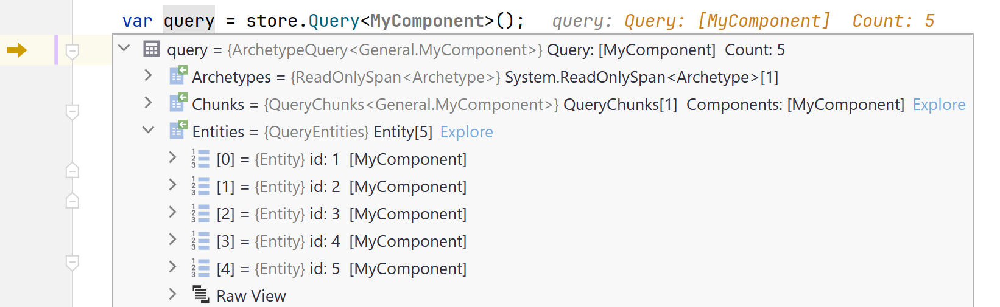
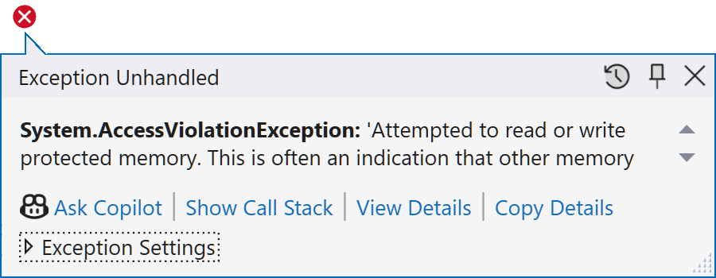
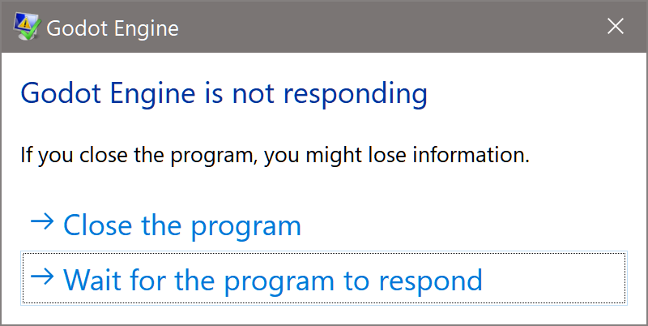
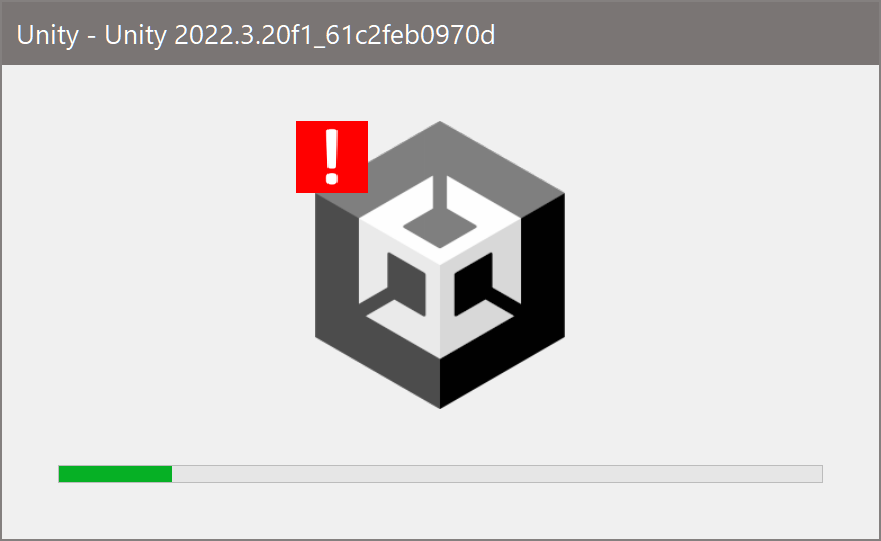
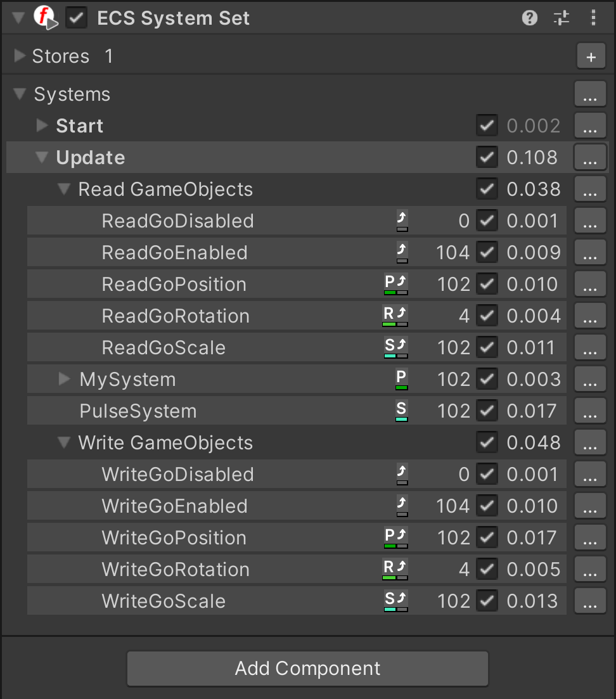

<div align="center">

  [](https://github.com/friflo/Friflo.Engine.ECS)   

</div>

<div align="center">

[](https://www.nuget.org/packages/Friflo.Engine.ECS)
[](https://app.codecov.io/gh/friflo/Friflo.Engine.ECS/tree/main/src/ECS)
[](https://github.com/friflo/Friflo.Engine.ECS/actions/workflows/engine.yml)
[](https://github.com/friflo/Friflo.Engine.ECS-Demos)
[](https://github.com/friflo/Friflo.Engine-docs)
[](https://discord.gg/nFfrhgQkb8)
[](https://friflo.gitbook.io/friflo.engine.ecs)

</div>

# Friflo.Engine.ECS

***The ECS for finishers 🏁***  
Leading performance in most ECS aspects.  
Performance Ratio - see [C# ECS Benchmark](https://github.com/friflo/ECS.CSharp.Benchmark-common-use-cases)

|         |     friflo | Flecs.NET  | TinyEcs    | Arch       | fennecs    | Leopotam   | DefaultEcs | Morpeh     |
| ------- | ----------:| ----------:| ----------:| ----------:| ----------:| ----------:| ----------:| ----------:|
| *Ratio* |       1.00 |       2.55 |       3.42 |       6.96 |      19.02 |       2.57 |       3.81 |      21.09 |
| *Notes* |            |            |            |            |            | [^sparse]  | [^sparse]  | [^sparse]  |

[^sparse]: Sparse Set based ECS projects.

## News

- [x]  Finally **Friflo.Engine.ECS** is now in its own new repository!  
  The ECS is moved including its git history. Everything not related to the ECS is omitted.

- [x] Published [Friflo.Engine.ECS.Boost](https://www.nuget.org/packages/Friflo.Engine.ECS.Boost) to enable
      [boosted queries](https://friflo.gitbook.io/friflo.engine.ecs/examples/optimization#boosted-query) with maximum performance.

- [x] Updated [Wiki ⋅ Optimization examples](https://friflo.gitbook.io/friflo.engine.ecs/examples/optimization#batching). Changes marked with 🔥 **Update**.

- [x] Released v3.0.0-preview  
      Introduced: **Entity Relationships** 1:1 and 1:many, **Relations** and full-text **Search** in O(1). See [Component Types](#-component-types)

- [x] New GitHub benchmark repository [ECS.CSharp.Benchmark - Common use-cases](https://github.com/friflo/ECS.CSharp.Benchmark-common-use-cases)  

## Contents

* [🔥 Friflo.Engine.ECS](#frifloengineecs)
  - [Feature highlights](#feature-highlights)
  - [Projects using friflo ECS](#projects-using-friflo-ecs)
  - [Demos](#demos)
  - [ECS definition](#ecs-definition)
* [⏩ Examples](#-examples)
  - [🚀 Hello World](#-hello-world)
  - [⌘ Component Types](#-component-types)
  - [⚙️ Systems](#️-systems)
* [📖 Wiki](#-wiki)
* [🏁 Benchmarks](#-ecs-benchmarks)

## Feature highlights

- [x] Simple API - no boilerplate, rock-solid 🗿 and bulletproof 🛡️
- [x] High-performance 🔥 compact ECS
- [x] Low memory footprint 👣. Create 100.000.000 entities in 1.5 sec
- [x] Zero ⦰ allocations after buffers are large enough. No struct boxing
- [x] High performant / type-safe queries ⊆
- [x] Efficient multithreaded queries ⇶
- [x] Entity component Search in O(1) ∈ 
- [x] Fast batch / bulk operations ⏩
- [x] Command buffers / deferred operations ⏭️
- [x] Entity relationships and relations ⌘
- [x] Entity hierarchy / tree ⪪
- [x] Fully reactive / entity events ⚡
- [x] Systems / System groups ⚙️
- [x] JSON Serialization 💿
- [x] SIMD Support 🧮
- [x] Supports .NET Standard 2.1 .NET 5 .NET 6 .NET 7 .NET 8    
  WASM / WebAssembly, Unity (Mono, AOT/IL2CPP, WebGL), Godot, MonoGame, ... and Native AOT
- [x] Debug Tools 🐞: Watch entities, components, tags, relations, query results, systems, ...
      <details>
        <summary>Screenshot - Watch ad-hoc query result in debugger</summary>
        
      </details>
- [x] **100%** verifiably safe 🔒 C#. No [*unsafe code*](https://learn.microsoft.com/en-us/dotnet/csharp/language-reference/unsafe-code),
      *native dll bindings* and *access violations*. 
      <details>
        <summary>Behavior of access violation bugs using unsafe code</summary>
        
        
        
      </details>

Complete feature list at [Wiki ⋅ Features](https://friflo.gitbook.io/friflo.engine.ecs/package/features).


Get package on [nuget](https://www.nuget.org/packages/Friflo.Engine.ECS/) or use the dotnet CLI.
```
dotnet add package Friflo.Engine.ECS
```


## Projects using friflo ECS

### [Horse Runner DX](https://store.steampowered.com/app/2955320/Horse_Runner_DX)

<a href="https://store.steampowered.com/app/2955320/Horse_Runner_DX"></a>  
Quote from developer: *"Just wanted to let you know that Friflo ECS 2.0.0 works like a charm in my little game.  
I use it for basically everything (landscape segments, vegetation, players, animations,  collisions and even the floating dust particles are entities).  
After some optimization there is no object allocation during gameplay - the allocation graph just stays flat - no garbage collection."*

## Demos

MonoGame Demo is available as WASM / WebAssembly app. [**Try Demo in your browser**](https://sdl-wasm-sample-web.vercel.app/docs/MonoGame/).  
Demo projects on GitHub below.
<table>
 <thead>
  <tr>
    <td><a href="https://github.com/friflo/Friflo.Engine.ECS-Demos/tree/main/MonoGame"></a></td>
    <td><a href="https://github.com/friflo/Friflo.Engine.ECS-Demos/tree/main/Unity"   ></a></td>
    <td><a href="https://github.com/friflo/Friflo.Engine.ECS-Demos/tree/main/Godot"   ></a></td>
  </tr>
 </thead>
 <tbody>
  <tr>
    <td align="center"><a href="https://github.com/friflo/Friflo.Engine.ECS-Demos/tree/main/MonoGame" >MonoGame</a></td>
    <td align="center"><a href="https://github.com/friflo/Friflo.Engine.ECS-Demos/tree/main/Unity"    >Unity</a></td>
    <td align="center"><a href="https://github.com/friflo/Friflo.Engine.ECS-Demos/tree/main/Godot"    >Godot</a></td>
  </tr>
 </tbody>
<table>

*Desktop Demo performance:* Godot 202 FPS, Unity 100 FPS at 65536 entities.  
All example Demos - **Windows**, **macOS** & **Linux** - available as projects for **MonoGame**, **Unity** and **Godot**.  
See [Demos · GitHub](https://github.com/friflo/Friflo.Engine.ECS-Demos)


## ECS definition

An entity-component-system (**ECS**) is a software architecture pattern. See [ECS ⋅ Wikipedia](https://en.wikipedia.org/wiki/Entity_component_system).  
It is often used in the Gaming industry - e.g. Minecraft - and used for high performant data processing.  
An ECS provide two strengths:

1. It enables writing *highly decoupled code*. Data is stored in **Components** which are assigned to objects - aka **Entities** - at runtime.  
   Code decoupling is accomplished by dividing implementation in pure data structures (**Component types**) - and code (**Systems**) to process them.  
  
2. It enables *high performant system execution* by storing components in continuous memory to leverage CPU caches L1, L2 & L3.  
   It improves CPU branch prediction by minimizing conditional branches when processing components in tight loops.

<br/>

# ⏩ Examples

This section contains two typical use cases when using an ECS.  
More examples are in the GitHub Wiki.

[**Examples - General**](https://friflo.gitbook.io/friflo.engine.ecs/examples/general)  
Explain fundamental ECS types like *Entity*, *Component*, *Tag*, *Command Buffer*, ... and how to use them.

[**Examples - Optimization**](https://friflo.gitbook.io/friflo.engine.ecs/examples/optimization)  
Provide techniques how to improve ECS performance.


## **🚀 Hello World**

The hello world examples demonstrates the creation of a world, some entities with components  
and their movement using a simple `ForEachEntity()` call.  

```csharp
public struct Velocity : IComponent { public Vector3 value; }

public static void HelloWorld()
{
    var world = new EntityStore();
    for (int n = 0; n < 10; n++) {
        world.CreateEntity(new Position(n, 0, 0), new Velocity{ value = new Vector3(0, n, 0)});
    }
    var query = world.Query<Position, Velocity>();
    query.ForEachEntity((ref Position position, ref Velocity velocity, Entity entity) => {
        position.value += velocity.value;
    });
}
```
In case of moving (updating) thousands or millions of entities an optimized approach can be used.  
See:
[Enumerate Query Chunks](https://friflo.gitbook.io/friflo.engine.ecs/examples/optimization#enumerate-query-chunks),
[Parallel Query Job](https://friflo.gitbook.io/friflo.engine.ecs/examples/optimization#parallel-query-job) and
[Query Vectorization - SIMD](https://friflo.gitbook.io/friflo.engine.ecs/examples/optimization#query-vectorization---simd).  
All query optimizations are using the same `query` but with different enumeration techniques.

<br/>


## **⌘ Component Types**

 in **Friflo.Engine.ECS v3.0.0-preview.2**

For specific use cases there is now a set of specialized component interfaces providing additional features.    
*Note:* Newly added features do not affect the behavior or performance of existing features.

The specialized component types enable entity relationships, relations and full-text search.  
Typical use case for entity relationships in a game are:
- Attack systems
- Path finding / Route tracing
- Model social networks. E.g friendship, alliances or rivalries
- Build any type of a [directed graph](https://en.wikipedia.org/wiki/Directed_graph)
  using entities as *nodes* and links or relations as *edges*.

Use cases for relations:
- Inventory systems
- Add multiple components of the same type to an entity

| Use case / Example                                                                                                        | Component interface type  | Description
| ------------------------------------------------------------------------------------------------------------------------- | ------------------------- | --------------------------------------------
| [Entity Relationships](https://friflo.gitbook.io/friflo.engine.ecs/examples/component-types#entity-relationships)  | **Link Component**        | A single link on an entity referencing another entity
|                                                                                                                           | **Link Relation**         | Multiple links on an entity referencing other entities
| [Relations](https://friflo.gitbook.io/friflo.engine.ecs/examples/component-types#relations)                        | **Relation Component**    | Add multiple components of same type to an entity
| [Search & Range queries](https://friflo.gitbook.io/friflo.engine.ecs/examples/component-types#search)              | **Indexed Component**     | Full text search of component fields executed in O(1).<br/>Range queries on component fields having a sort order.

Big shout out to [**fenn**ecs](https://github.com/outfox/fennecs) and [**flecs**](https://github.com/SanderMertens/flecs)
for the challenge to improve the feature set and performance of this project!

<br/>


## **⚙️ Systems**

Systems are new in **Friflo.Engine.ECS v2.0.0**

Systems in ECS are typically queries.  
So you can still use the `world.Query<Position, Velocity>()` shown in the "Hello World" example.  

Using Systems is optional but they have some significant advantages.

**System features**

- Enable chaining multiple decoupled [QuerySystem](https://github.com/friflo/Friflo.Engine-docs/blob/main/api/QuerySystem.md) classes in a
  [SystemGroup](https://github.com/friflo/Friflo.Engine-docs/blob/main/api/SystemGroup.md).  
  Each group provide a [CommandBuffer](https://friflo.gitbook.io/friflo.engine.ecs/examples/optimization#commandbuffer).

- A system can have state - fields or properties - which can be used as parameters in `OnUpdate()`.  
  The system state can be serialized to JSON.

- Systems can be enabled/disabled or removed.  
  The order of systems in a group can be changed.

- Systems have performance monitoring build-in to measure execution times and memory allocations.  
  If enabled systems detected as bottleneck can be optimized.  
  A perf log (see example below) provide a clear overview of all systems their amount of entities and impact on performance.

- Multiple worlds can be added to a single  [SystemRoot](https://github.com/friflo/Friflo.Engine-docs/blob/main/api/SystemRoot.md) instance.  
  `root.Update()` will execute every system on all worlds.


```csharp
public static void HelloSystem()
{
    var world = new EntityStore();
    for (int n = 0; n < 10; n++) {
        world.CreateEntity(new Position(n, 0, 0), new Velocity(), new Scale3());
    }
    var root = new SystemRoot(world) {
        new MoveSystem(),
    //  new PulseSystem(),
    //  new ... multiple systems can be added. The execution order still remains clear.
    };
    root.Update(default);
}
        
class MoveSystem : QuerySystem<Position, Velocity>
{
    protected override void OnUpdate() {
        Query.ForEachEntity((ref Position position, ref Velocity velocity, Entity entity) => {
            position.value += velocity.value;
        });
    }
}
```

A valuable strength of an ECS is establishing a clear and decoupled code structure.  
Adding the `PulseSystem` below to the `SystemRoot` above is trivial.  
This system uses a `foreach (var entity in Query.Entities)` as an alternative to `Query.ForEachEntity((...) => {...})`  
to iterate the query result.

```csharp
struct Pulsating : ITag { }

class PulseSystem : QuerySystem<Scale3>
{
    float frequency = 4f;
    
    public PulseSystem() => Filter.AnyTags(Tags.Get<Pulsating>());
    
    protected override void OnUpdate() {
        foreach (var entity in Query.Entities) {
            ref var scale = ref entity.GetComponent<Scale3>().value;
            scale = Vector3.One * (1 + 0.2f * MathF.Sin(frequency * Tick.time));
        }
    }
}
```

### ⏱ System monitoring

System performance monitoring is disabled by default.  
To enable monitoring call:

```csharp
root.SetMonitorPerf(true);
```

When enabled system monitoring captures
- Number of system executions.
- System execution duration in ms.
- Memory heap allocations per system in bytes.
- The number of entities matching a query system.


#### Realtime monitoring

In a game editor like Unity system monitoring is available in the **ECS System Set** component.
<details>
<summary>Screenshot: <b>ECS System Set</b> component in Play mode</summary>

</details>


#### Log monitoring

The performance statistics available at [SystemPerf](https://github.com/friflo/Friflo.Engine-docs/blob/main/api/SystemPerf.md).  
To get performance statistics on console use:

```csharp
root.Update(default);
Console.WriteLine(root.GetPerfLog());
```

The log result will look like:
```js
stores: 1                  on   last ms    sum ms   updates  last mem   sum mem  entities
---------------------      --  --------  --------  --------  --------  --------  --------
Systems [2]                 +     0.076     3.322        10       128      1392
| ScaleSystem               +     0.038     2.088        10        64       696     10000
| PositionSystem            +     0.038     1.222        10        64       696     10000
```
```
on                  + enabled  - disabled
last ms, sum ms     last/sum system execution time in ms
updates             number of executions
last mem, sum mem   last/sum allocated bytes
entities            number of entities matching a QuerySystem
```

<br/>


# 📖 Wiki

The **GitHub Wiki** provide you detailed information about the ECS and illustrate them by examples.

- [**Examples - General**](https://friflo.gitbook.io/friflo.engine.ecs/examples/general)  
  Explain fundamental ECS types like *Entity*, *Component*, *Tag*, *Command Buffer*, ... and show you how to use them.  
  Contains an example for [Native AOT](https://learn.microsoft.com/en-us/dotnet/core/deploying/native-aot) integration.

- [**Examples - Optimization**](https://friflo.gitbook.io/friflo.engine.ecs/examples/optimization)  
  Provide you techniques how to improve ECS performance.

- [**Extensions**](https://friflo.gitbook.io/friflo.engine.ecs/extensions/unity-extension)  
  Projects extending Friflo.Engine.ECS with additional features.
  
- [**Features**](https://friflo.gitbook.io/friflo.engine.ecs/package/features)  
  Integration possibilities, a complete feature list and performance characteristics 🔥.

- [**Library**](https://friflo.gitbook.io/friflo.engine.ecs/package/library)  
  List supported platforms, properties of the assembly dll and build statistics.

- [**Release Notes**](https://friflo.gitbook.io/friflo.engine.ecs/package/release-notes)  
  List of changes of every release available on nuget.

<br/>


# 🏁 ECS Benchmarks

## ECS.CSharp.Benchmark - Common use-cases

Created a new GitHub repository [ECS.CSharp.Benchmark - Common use-cases](https://github.com/friflo/ECS.CSharp.Benchmark-common-use-cases).  
It compares the performance of multiple ECS projects with **simple** benchmarks.  
So they can be used as a **guide to migrate** form one ECS to another.  
See discussion of [reddit announcement Post](https://www.reddit.com/r/EntityComponentSystem/comments/1e0qo62/just_published_new_github_repo_ecs_c_benchmark/).


## ECS.CSharp.Benchmark

Performance comparison using popular **ECS C# benchmark** on GitHub.  
Two benchmarks - subset of [GitHub ⋅ Ecs.CSharp.Benchmark + PR #38](https://github.com/Doraku/Ecs.CSharp.Benchmark/pull/38)
running on a Mac Mini M2.

See [Benchmark results](docs/doraku-benchmark.md).

<br/>


**License**

This project is licensed under LGPLv3.  

Friflo.Engine.ECS  
Copyright © 2024   Ullrich Praetz - https://github.com/friflo